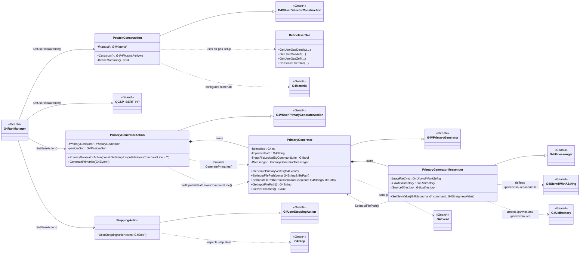

# POWTEX Class UML (Project Classes Vs Geant4 Base Classes)

Legend:
- Project classes: PowtexConstruction, PrimaryGeneratorAction, PrimaryGenerator, PrimaryGeneratorMessenger, SteppingAction, DefineUserGas.
- Geant4 classes: G4VUserDetectorConstruction, G4VUserPrimaryGeneratorAction, G4VPrimaryGenerator, G4UImessenger, G4UserSteppingAction, G4RunManager, QGSP_BERT_HP, G4Event, G4Step, G4Material, G4UIcmdWithAString, G4UIdirectory.
- Primary input file can be set from macro command /powtex/source/inputFile or from command line --input-file/-f.
- Command-line input path has precedence and locks out later macro overrides.
