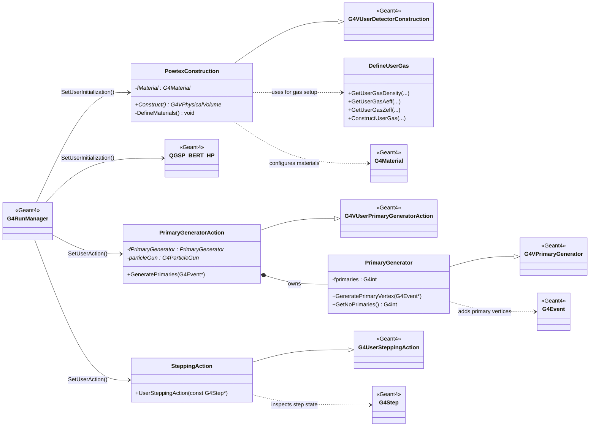

# POWTEX Class UML (Project Classes Vs Geant4 Base Classes)

Legend:
- Project classes: PowtexConstruction, PrimaryGeneratorAction, PrimaryGenerator, SteppingAction, DefineUserGas.
- Geant4 classes: G4VUserDetectorConstruction, G4VUserPrimaryGeneratorAction, G4VPrimaryGenerator, G4UserSteppingAction, G4RunManager, QGSP_BERT_HP, G4Event, G4Step, G4Material.
