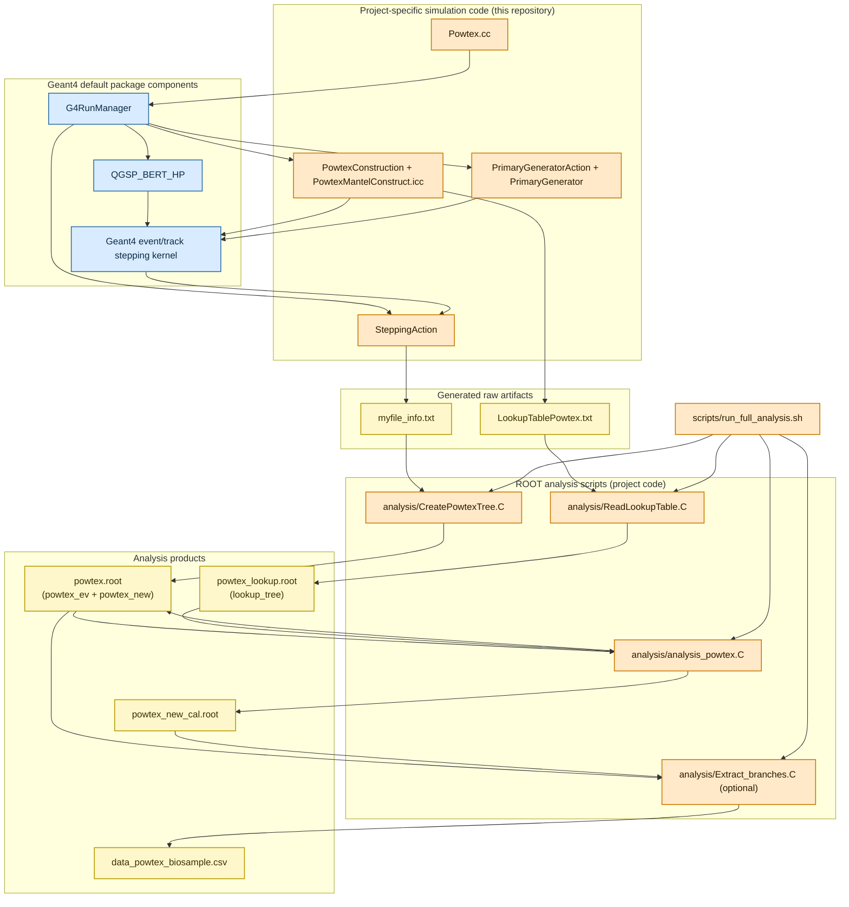

# POWTEX Output And Analysis Pipeline

```mermaid
flowchart TB
  subgraph USER_SIM["Project-specific simulation code (this repository)"]
    MAIN["Powtex.cc"]
    DET["PowtexConstruction + PowtexMantelConstruct.icc"]
    STEP["SteppingAction"]
    PGEN["PrimaryGeneratorAction + PrimaryGenerator"]
  end

  subgraph G4["Geant4 default package components"]
    RM["G4RunManager"]
    PHYS["QGSP_BERT_HP"]
    KERNEL["Geant4 event/track stepping kernel"]
  end

  subgraph RAW["Generated raw artifacts"]
    HITTXT["myfile_info.txt"]
    LOOKUPTXT["LookupTablePowtex.txt"]
  end

  subgraph ROOT_PIPE["ROOT analysis scripts (project code)"]
    S1["analysis/CreatePowtexTree.C"]
    S2["analysis/ReadLookupTable.C"]
    S3["analysis/analysis_powtex.C"]
    S4["analysis/Extract_branches.C (optional)"]
  end

  subgraph PRODUCTS["Analysis products"]
    ROOT1["powtex.root\n(powtex_ev + powtex_new)"]
    ROOT2["powtex_lookup.root\n(lookup_tree)"]
    ROOT3["powtex_new_cal.root"]
    CSV["data_powtex_biosample.csv"]
  end

  BATCH["scripts/run_full_analysis.sh"]

  MAIN --> RM
  RM --> PHYS
  RM --> DET
  RM --> PGEN
  RM --> STEP

  PHYS --> KERNEL
  DET --> KERNEL
  PGEN --> KERNEL
  KERNEL --> STEP

  STEP --> HITTXT
  DET --> LOOKUPTXT

  HITTXT --> S1
  LOOKUPTXT --> S2
  S1 --> ROOT1
  S2 --> ROOT2
  ROOT1 --> S3
  ROOT2 --> S3
  S3 --> ROOT1
  S3 --> ROOT3
  ROOT1 --> S4
  ROOT3 --> S4
  S4 --> CSV

  BATCH --> S1
  BATCH --> S2
  BATCH --> S3
  BATCH --> S4

  classDef user fill:#ffe9c9,stroke:#cc7a00,color:#2a1a00,stroke-width:1.5px;
  classDef g4 fill:#d9ecff,stroke:#2f6fad,color:#0b2a44,stroke-width:1.5px;
  classDef data fill:#fff7cc,stroke:#b89b00,color:#3a3000,stroke-width:1.5px;

  class MAIN,DET,STEP,PGEN,S1,S2,S3,S4,BATCH user;
  class RM,PHYS,KERNEL g4;
  class HITTXT,LOOKUPTXT,ROOT1,ROOT2,ROOT3,CSV data;
```

Legend:
- Orange nodes: explicitly coded in this repository.
- Blue nodes: Geant4 components provided by default.
- Yellow nodes: generated data artifacts.
