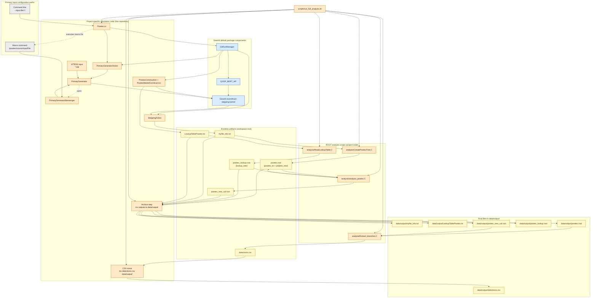

# POWTEX Output And Analysis Pipeline

Legend:
- Orange nodes: explicitly coded in this repository.
- Blue nodes: Geant4 components provided by default.
- Yellow nodes: generated data artifacts (both temporary and final stored outputs).
- Gray nodes: runtime input-configuration commands for primary source selection.
- Precedence rule: command-line --input-file/-f value is locked and cannot be overridden later by macro commands.
- Step ordering in scripts/run_full_analysis.sh: steps 1-4 create/update ROOT files, then files are moved to data/output/, then Extract_branches.C reads from data/output and exports detections.csv.
