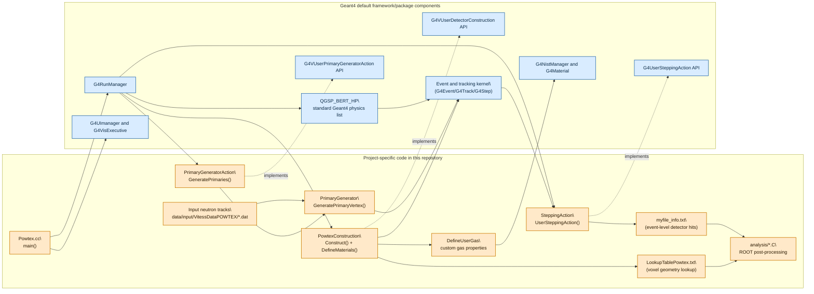

# POWTEX Simulation Data And Control Flow

```mermaid
flowchart LR
  subgraph USER["Project-specific code in this repository"]
    MAIN["Powtex.cc\\nmain()"]
    PC["PowtexConstruction\\nConstruct() + DefineMaterials()"]
    DUG["DefineUserGas\\ncustom gas properties"]
    PGA["PrimaryGeneratorAction\\nGeneratePrimaries()"]
    PG["PrimaryGenerator\\nGeneratePrimaryVertex()"]
    SA["SteppingAction\\nUserSteppingAction()"]
    IN["Input neutron tracks\\ndata/input/VitessDataPOWTEX/*.dat"]
    OUT1["myfile_info.txt\\n(event-level detector hits)"]
    OUT2["LookupTablePowtex.txt\\n(voxel geometry lookup)"]
    ANA["analysis/*.C\\nROOT post-processing"]
  end

  subgraph G4["Geant4 default framework/package components"]
    RM["G4RunManager"]
    PHYS["QGSP_BERT_HP\\nstandard Geant4 physics list"]
    API_DET["G4VUserDetectorConstruction API"]
    API_GEN["G4VUserPrimaryGeneratorAction API"]
    API_STEP["G4UserSteppingAction API"]
    EVT["Event and tracking kernel\\n(G4Event/G4Track/G4Step)"]
    MAT["G4NistManager and G4Material"]
    UI["G4UImanager and G4VisExecutive"]
  end

  MAIN --> RM
  MAIN --> UI

  RM --> PHYS
  RM --> PC
  RM --> PGA
  RM --> SA

  PC -.implements.-> API_DET
  PGA -.implements.-> API_GEN
  SA -.implements.-> API_STEP

  PC --> DUG
  DUG --> MAT

  IN --> PG
  PGA --> PG
  PG --> EVT
  PHYS --> EVT
  PC --> EVT

  EVT --> SA
  SA --> OUT1
  PC --> OUT2

  OUT1 --> ANA
  OUT2 --> ANA

  classDef user fill:#ffe9c9,stroke:#cc7a00,color:#2a1a00,stroke-width:1.5px;
  classDef g4 fill:#d9ecff,stroke:#2f6fad,color:#0b2a44,stroke-width:1.5px;

  class MAIN,PC,DUG,PGA,PG,SA,IN,OUT1,OUT2,ANA user;
  class RM,PHYS,API_DET,API_GEN,API_STEP,EVT,MAT,UI g4;
```

Legend:
- Orange nodes: explicitly coded in this repository.
- Blue nodes: components provided by Geant4 by default.
